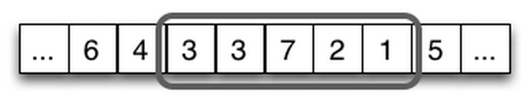

# Rate Limiting

Rate limiting controls the rate of requests that can be forwarded by a Hyperbahn
process. The motivation behind is that a service should never stress Hyperbahn in
such a way that the quality of other services gets affected.
In general, rate limiting can be considered as a firewall between services.

## Goals

Hyperbahn serves as a communication bus for services. In practice, a service
can have a surge of  requests due to various of reasons such as sudden increase of
demands or failures/retries. When such events occur, these requests may saturate the 
Hyperbahn nodes and cause a service quality degradation.

There are two goals of rate limiting:

* Control the RPS (Request Per Second) that a service can have on a Hyperbahn node.
* Control the total RPS that a Hyperbahn node should handle.

Non-goals:

* Rate limiting is not used to limit the healthy growth of a service's requests.
* Rate limiting is not [Circuit Breaking](./circuit-breaking.md). It treats all
  requests the same.
* Rate limiting is not SLA (Service Level Agreement). It only guarantees to control
  requests that go above limits.

## Design & Implemenation

### The rate
We use RPS (Request Per Second) to quantify the request rate. At any point of time,
RPS is the total number of requests processed in the past second. There are various
ways of counting RPS. We use a sliding window to maintain the RPS counter. As shown below,
if we divide a second into five buckets, each bucket contains the number of requests during
that 200ms slot. When time goes on, the window moves forward such that the oldest bucket is
discarded and the new bucket added. In this example, when time moves forward 200ms, the RPS
changes from 19 to 16. It is straitfoward to infer that the more buckets used, the more
accurate the counter will be. In implementation, a circular array should be used to simulate
the infinite span of time.

### Limiting the rate
All requests received in the situation of over limit should be responded with error
frames `Busy (0x03)`.

### Maximum RPS per node 
Maximum RPS per node is the upper limit of requests that should be processed by a 
given Hyperbahn node. After passing the limit, `Busy (0x03)` error frames will be
returned until the RPS drops below the limit.

### Maximum RPS per service on egress nodes
Maximum RPS per service on egress nodes is the upper limit of requests that should be processed
by a given Hyperbahn egress node for a service. After passing the limit, `Busy (0x03)`
error frames will be returned until the RPS for the service drops below the limit.

### Maximum RPS per service on ingress nodes
Maximum RPS per service on ingress nodes is the upper limit of requests that should be processed
by a given Hyperbahn ingress node for a service. After passing the limit, `Busy (0x03)`
error frames will be returned until the RPS for the service drops below the limit.

### Service alerts
While enforcing the hard limit on RPS, alerts should also be provided to help mitigate the over
limiting incidents.

* Warnings: when current RPS is reaching a given percentage (e.g., 85%) of the limit,
  warnings should be sent. The threshold for warnings may also consider the growth speed of the RPS. 
* Errors: when current RPS passes the limit, errors should be sent.

## Test plan
* Unit tests
* Integration tests in hyperbhan cluster
